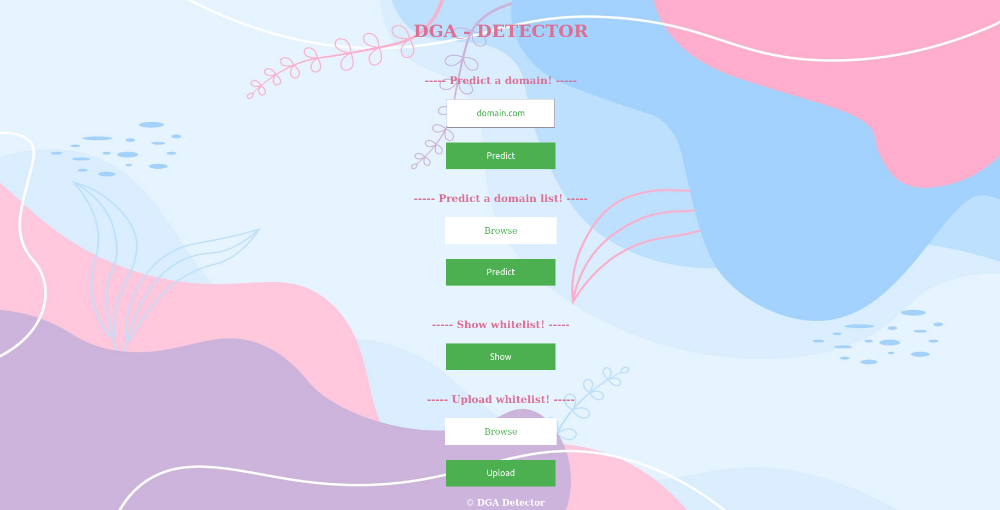
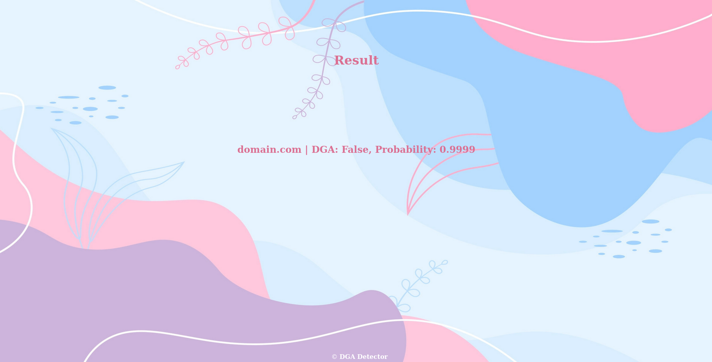
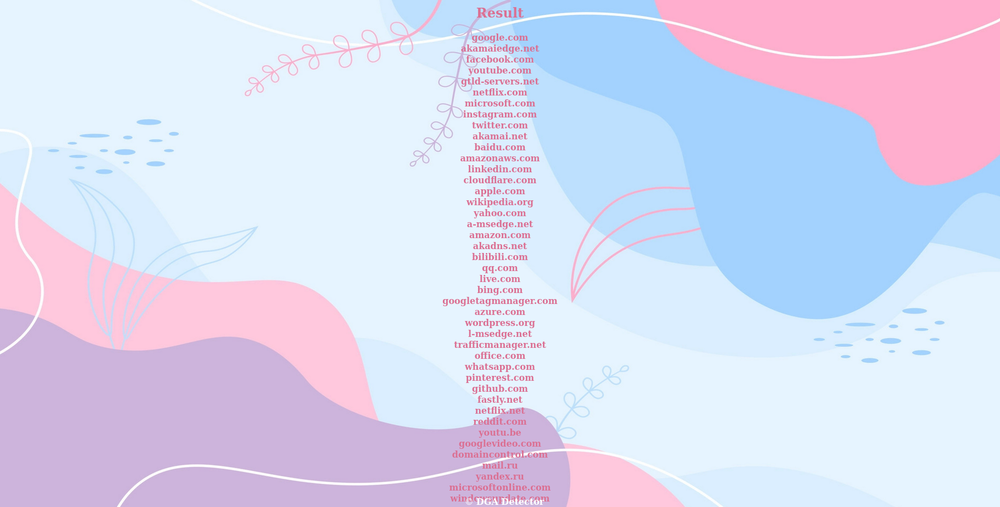
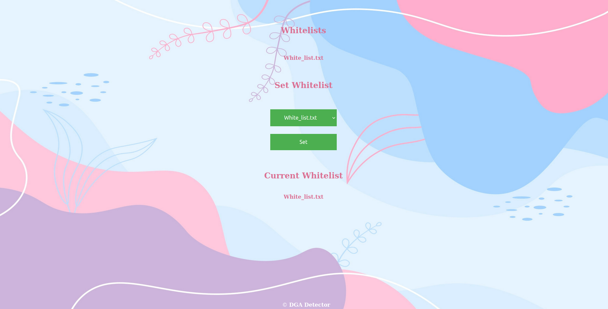

# DGA DETECTOR

## Project

This is a web service that detect DGA generated domains.

### What is DGA?

DGAs are a large family of algorithms that help malware periodically generate large numbers of domain names that can be used as points of contact with Command and Control servers.

DGAs are often long and meaningless to avoid conflicting with a previously registered domain name, for example;

- cvyh1po636avyrsxebwbkn7.ddns.net
- bqlqscpqwsh.dynserv.com
- txumyqrubwutbb.cc

However, DGA can also be formed by bringing together meaningful words and names, they are more difficult to detect than others;
- brothernerveplacebringconsult.com
- capitalhuntdealsmokeboxclue.com
- jeannetteabrahamson.net

### DGA Detection Model

There are two basic ways to do this: reactionary and real-time. The first technique relies on statistical data such as DNS responses, IP address location, WHOIS and TLS certificate information to determine domain name validity. The other technique concentrates on the analysis of the domain taken as a regular string of characters. Within the latter technique, there is a wide variety of approaches to detecting these unnatural or strange areas. The most common are:

- **Dividing the domain into N-grams and then performing frequency analysis**: The N-gram approach is particularly effective when performance is critical, but its implementation is quite complex and its accuracy is rather average. 
- **Calculating the field’s entropy (this is problematic with non-ASCII fields and dictionary-based DGAs)**: The entropy approach is the most efficient in terms of memory and CPU usage. Its accuracy is the lowest of the three, but because of its ease of use, speed, and simplicity, it can be utilized if you only need a rough estimate and don’t mind false alarms. 
- **Applying machine learning to domain analysis**: Well-trained neural networks can produce unexpected findings with almost no false alarms. However, in exchange for great accuracy, it sacrifices performance and resource utilization. If accuracy is crucial, machine learning is the way to go.

#### Dataset

A data set was created by using the 360 Netlab database containing 59 different DGA algorithm domain names and the Tranco database containing the most visited 1 million domain names worldwide. The dataset contains a total of 1970159 records.

#### Preprocess 

[Bert Tokenizer](https://huggingface.co/docs/transformers/model_doc/bert)

#### Classification Model

[Fasttext](https://fasttext.cc/docs/en/support.html)

### More Detail

[Medium](https://medium.com/crypttech-research/the-identification-and-detection-of-domain-generation-algorithms-bce4e5114917)

## Usage

Clone the project repository using the following command:

```cmd
git clone https://github.com/Suedaglgn/DGA-Detector.git
```

Change directory to the app directory. Replace /path/to/project with the path to your project directory.
```cmd
cd /path/to/project/DGA-Detector
```
Build the container image:

```cmd
docker build -t dga-detector .
```

Start your container using the docker run command and specify the name of the image you just created:
```cmd
docker run --name dga-container dga-detector
```

## Some Pictures







